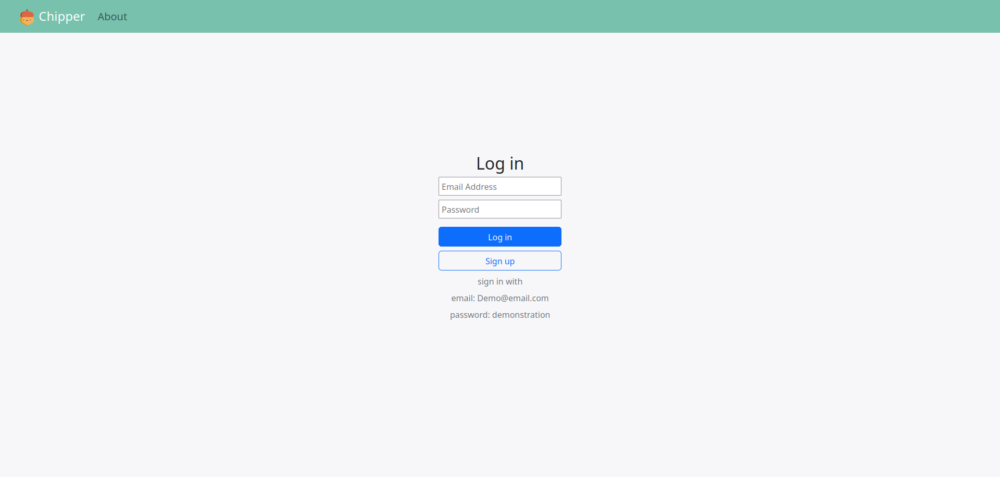
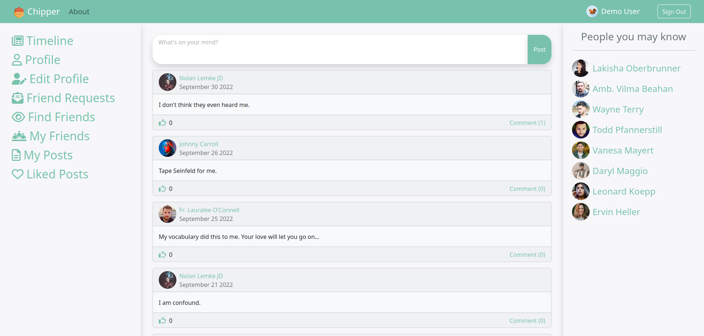
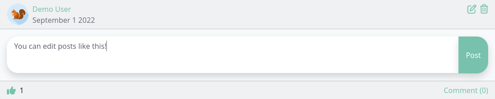
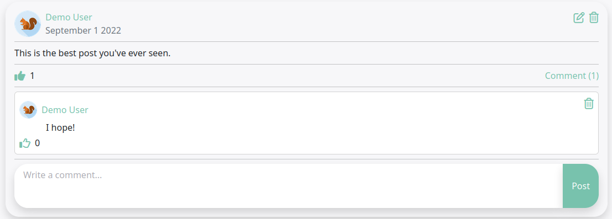
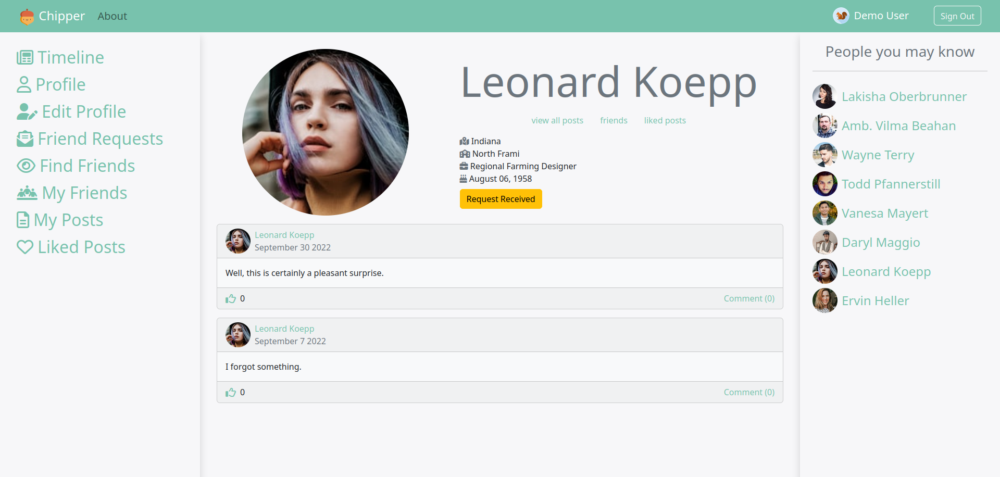
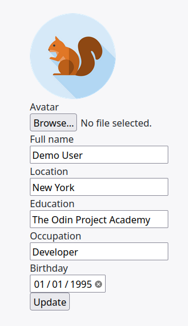
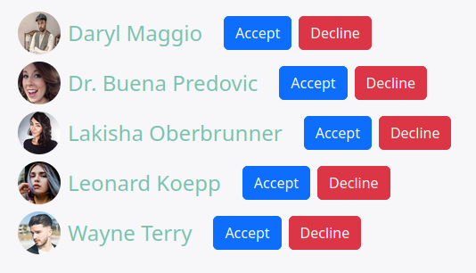
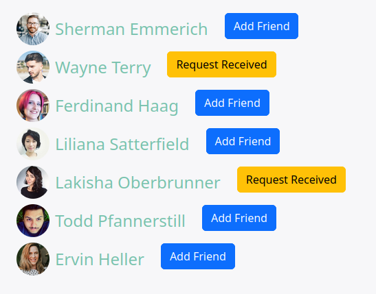
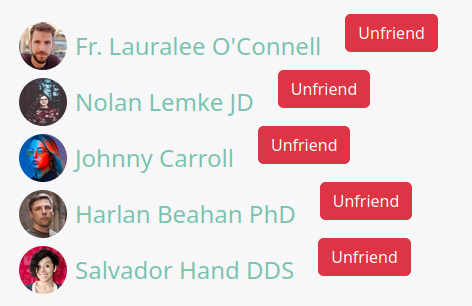
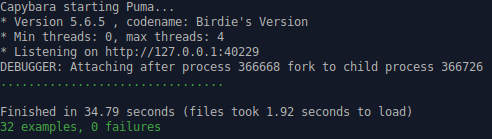

# Chipper Social

This is the final project from [The Odin Project's](https://www.theodinproject.com) <strong>Ruby on Rails</strong> curriculum.


The original project can be found here: [Building Facebook](https://www.theodinproject.com/lessons/ruby-on-rails-rails-final-project)  
The Ruby on Rails curriculum and course framework can be found [HERE](https://www.theodinproject.com/paths/full-stack-ruby-on-rails/courses/ruby-on-rails).

### Functionality

1. <strong>PostgreSQL</strong> Database
2. 32 Tests using <strong>RSpec</strong>, <strong>Capybara</strong>, and <strong>FactoryBot</strong>
3. Styled with <strong>custom CSS</strong> and <strong>Bootstrap CSS</strong>
4. Uses <strong>action mailer</strong> to send new users a welcome email. 
5. Uses <strong>Devise</strong> gem to handle user sessions, registrations, and authentication
6. Seeds 20 fake users using the <strong>Faker</strong> gem
7. Uses <strong>Gravatar</strong> to handle default avatars
8. Demo@test.com account comes preloaded with:
  * An avatar
  * 5 friends
  * 5 friend requests 
  * 10 strangers 
  * Each user has 1-3 posts.
9. Uses <strong>Turbo Frames</strong>
  * The middle column of the holy grail layout is constantly being replaced with other Turbo Frames
  * Editing a post replaces the content section with a turbo framed text box
10. Posts have many features. They can be:
  * Created
  * Liked
  * Commented on
  * Edited
  * Deleted
11. The like model makes use of a <strong>polymorphic association</strong> (likeable)
  * Posts and comments are both likeable
12. Every user has their own profile. A profile contains:
  * The user's avatar
  * Links to view the user's posts, friends, and liked posts
  * 4 optional information fields: location, education, occupation, and birthday
  * A feed of that user's previous posts
13. Users can edit their own profile. They can update:
  * Their user avatar by <strong>uploading an image</strong> from their local machine using <strong>active storage</strong>
  * Their name and four other optional information fields
14. There are 3 tabs related to friendships:
  * Friend Requests: displays who has sent you a friend request
  * Find friends: displays strangers and users who have sent you a friend request
  * My friends: displays friends that you have made. You can also unfriend friends here.
15. Users can also view their own posts and posts that they've 
16. Uses images from the <strong>asset pipeline</strong>


### Live Demo

(This may require around 20-30 seconds to load!)  
[Link to Heroku Live Demo](https://chipper-social.herokuapp.com/users/sign_in)

### Screenshots
<p float = 'left' >
<figure>
  <figcaption>Chipper Log In Page</figcaption>
  
</figure>
<figure>
  <figcaption>Timeline</figcaption>
  
</figure>
<figure>
  <figcaption>Create, edit, delete, and like posts</figcaption>
  
</figure>
<figure>
  <figcaption>Comment on posts and like comments</figcaption>
  
</figure>
<figure>
  <figcaption>View user profiles</figcaption>
  
</figure>
<figure>
  <figcaption>Edit your own profile</figcaption>
  
</figure>
<figure>
  <figcaption>Find friends you haven't connected with yet</figcaption>
  
</figure>
<figure>
  <figcaption>Friend requests</figcaption>
  
</figure>
<figure>
  <figcaption>My friends</figcaption>
  
</figure>
<figure>
  <figcaption>Passing Tests</figcaption>
  
</figure>
</p>

### Local Installation
To get started with the app, make sure you have Rails and Git installed on your machine
Clone the repo to your local machine:
```ruby
$ git clone git@github.com:BrentBarnes/Chipper-Social.git
```
Then, install the needed gems:
```ruby
$ bundle install
```
Next, migrate the database:
```ruby
$ rails db:migrate
```
Load sample users, posts, and friendships!
```ruby
$ rails db:seed
```
Run the tests:
```ruby
$ rspec ./spec/features
```